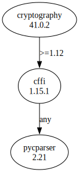

# Third Party Dependencies

<!--[[[fill sbom_sha256()]]]-->
The [SBOM in CycloneDX v1.4 JSON format](https://git.sr.ht/~sthagen/vastaanottaa/blob/default/etc/sbom/cdx.json) with SHA256 checksum ([d0a82dd9 ...](https://git.sr.ht/~sthagen/vastaanottaa/blob/default/etc/sbom/cdx.json.sha256 "sha256:d0a82dd95f53335fefc14073f29103354c362632b8fc74f90037ebd95a8b9270")).
<!--[[[end]]] (checksum: 4a765f57904825c36a37a9b37d68636c)-->
## Licenses 

JSON files with complete license info of: [direct dependencies](direct-dependency-licenses.json) | [all dependencies](all-dependency-licenses.json)

### Direct Dependencies

<!--[[[fill direct_dependencies_table()]]]-->
| Name                                                 | Version                                                 | License                              | Author                                                                                       | Description (from packaging data)                                                                   |
|:-----------------------------------------------------|:--------------------------------------------------------|:-------------------------------------|:---------------------------------------------------------------------------------------------|:----------------------------------------------------------------------------------------------------|
| [cryptography](https://github.com/pyca/cryptography) | [41.0.2](https://pypi.org/project/cryptography/41.0.2/) | Apache Software License; BSD License | The Python Cryptographic Authority and individual contributors <cryptography-dev@python.org> | cryptography is a package which provides cryptographic recipes and primitives to Python developers. |
<!--[[[end]]] (checksum: e3ef62a6533a858af83b36478887ee43)-->

### Indirect Dependencies

<!--[[[fill indirect_dependencies_table()]]]-->
| Name                                             | Version                                          | License     | Author                         | Description (from packaging data)                     |
|:-------------------------------------------------|:-------------------------------------------------|:------------|:-------------------------------|:------------------------------------------------------|
| [cffi](http://cffi.readthedocs.org)              | [1.15.1](https://pypi.org/project/cffi/1.15.1/)  | MIT License | Armin Rigo, Maciej Fijalkowski | Foreign Function Interface for Python calling C code. |
| [pycparser](https://github.com/eliben/pycparser) | [2.21](https://pypi.org/project/pycparser/2.21/) | BSD License | Eli Bendersky                  | C parser in Python                                    |
<!--[[[end]]] (checksum: 670b9b7cbd852440c4c48f5792c67d06)-->

## Dependency Tree(s)

JSON file with the complete package dependency tree info of: [the full dependency tree](package-dependency-tree.json)

### Rendered SVG

Base graphviz file in dot format: [Trees of the direct dependencies](package-dependency-tree.dot.txt)



### Console Representation

<!--[[[fill dependency_tree_console_text()]]]-->
````console
cryptography==41.0.2
└── cffi [required: >=1.12, installed: 1.15.1]
    └── pycparser [required: Any, installed: 2.21]
````
<!--[[[end]]] (checksum: e1aac276a5eec102c5f305050d8dd296)-->
